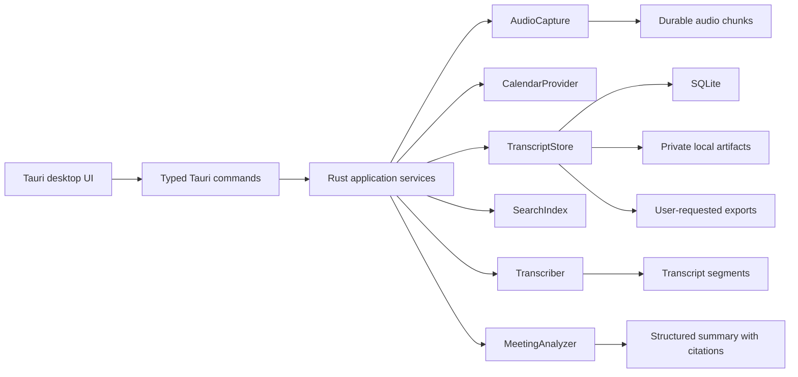

# Curiosity Transcripts: Local-First Rust App Plan

Research date: 2026-05-21

Status note, 2026-07-07: this plan describes the target product direction. The
current shipped desktop export surface is JSON only; Markdown and SRT are
lower-level helpers until they are productized in the desktop UI and Tauri
commands. See `docs/production-readiness-roadmap.md` for the current release
source of truth.

## Product Wedge

The defensible wedge is not "another local AI notetaker." Meetily, Anarlog, OpenWhispr, Vibe, and Minutes already cover much of that surface.

Curiosity Transcripts should compete on trust-verifiable local meeting capture:

- The user can prove what was recorded, where it is stored, what left the device, and how to delete it.
- The app treats crash recovery, export, deletion, permissions, and recording consent as core product features, not settings-page afterthoughts.
- Calendar integration is used first for safe context and naming, not silent automation.
- AI analysis is useful but secondary to a durable local transcript the user owns.

## MVP Success Criteria

The first shippable milestone succeeds when:

- A macOS user can manually record a meeting from microphone or imported audio, with a clear recording indicator.
- The app can run in default offline mode with no OpenAI key, no calendar account, no telemetry, and no required network calls after model setup.
- A local transcript is created, editable enough for correction, searchable by keyword, exportable to Markdown/JSON/SRT, and deletable with all related artifacts.
- The app shows a per-meeting privacy state: raw audio retained or not, local-only or hosted provider used, storage location, and export status.
- A crash during recording or transcription leaves recoverable chunks and an explicit recovery state.
- The app is test-driven: deterministic logic is covered with unit and integration tests before platform/manual smoke tests.

## Long-Term Success Criteria

The longer-term app should:

- Run locally on macOS first, with Windows support through explicit platform adapters.
- Record meeting audio from the computer and room microphone with clear consent.
- Transcribe locally by default, with optional OpenAI or OpenAI-compatible transcription.
- Use Ollama or another local model runtime for private summaries and structured analysis, with hosted LLMs strictly opt-in.
- Integrate with Apple Calendar first, then Google Calendar and Outlook when users opt in.
- Prompt or start recording from calendar context only after safe allowlist rules are in place.

## Assumptions

- "Room audio" means microphone or external conference microphone capture, not custom beamforming hardware.
- "Mac first" means using macOS-native capture and calendar APIs where they are the most reliable path.
- "Rust app" means a Rust core and desktop shell; the UI can still be rendered with Tauri and a web frontend if that keeps the app shippable and cross-platform.
- Privacy is a product invariant. Cloud transcription, hosted LLMs, Google Calendar, and Outlook are optional connectors.
- The first implementation should not attempt bot-based meeting joining. Capturing local mic and system audio is simpler, more private, and better aligned with an open-source desktop app.

## Existing Projects To Learn From

| Project | Stack | Local/AI posture | Calendar/automation | What to borrow | What to avoid |
| --- | --- | --- | --- | --- | --- |
| [Meetily](https://github.com/Zackriya-Solutions/meetily) | Rust, Tauri, Next.js, SQLite | Local Whisper/Parakeet transcription; Ollama and OpenAI-compatible summaries | Calendar integration is described as coming soon or Pro-side | Simple Tauri/Rust spine, GPU-aware local transcription, provider settings, local meeting schema | Do not depend on roadmap-only features; search appears basic; community/pro split may hide desired features |
| [Anarlog](https://github.com/fastrepl/anarlog) | Rust workspace, Tauri, React, many plugins/crates | Local transcription and BYO OpenAI, Anthropic, Gemini, OpenRouter, Ollama, LM Studio | Apple, Google, and Outlook provider code paths; meeting detection and scheduled automation patterns | Markdown-first ownership, calendar abstraction, full-text search, provider isolation, Tauri plugin discipline | Too heavy for v1; copy boundaries, not the whole architecture |
| [screenpipe](https://github.com/mediar-ai/screenpipe) | Rust, Tauri, SQLite/FTS, local capture APIs | Local capture/search with optional Ollama/OpenAI agents | Apple, Windows, Google, and ICS context | OS capture and local search ideas | Broad screen/audio capture scope can distract from meetings |
| [OpenWhispr](https://github.com/OpenWhispr/openwhispr) | Electron, React, TypeScript, SQLite | Local Whisper/Parakeet plus BYO cloud | Google Calendar and call detection UX | Product UX for meeting detection, speaker identity, notes, MCP/API | Electron stack is not the technical direction |
| [Minutes](https://github.com/silverstein/minutes) | Rust CLI plus Tauri desktop | Whisper/Parakeet/local diarization; Claude/Ollama/OpenAI optional | Mac-first desktop flows, live transcript JSONL, agent access | Agent-readable artifacts, live transcript stream, local relationship graph ideas | Very broad scope; do not make agent features a v1 dependency |
| [Vibe](https://github.com/thewh1teagle/vibe) | Tauri v2, Rust, React/Vite | Offline Whisper, mic/system audio, diarization, Ollama summaries, CLI/API | No external calendar focus found | Model management, export formats, CLI/API ergonomics | Calendar automation must come from elsewhere |
| [OpenSW](https://github.com/liebe-magi/OpenSW) | Rust, Tauri 2, React, whisper-rs | Local Whisper, optional Ollama refinement | None | Small Tauri speech-to-text shape, global shortcut, tray, updater | Dictation-first; not enough meeting organization |
| [ownscribe](https://github.com/paberr/ownscribe) | Python CLI, Swift audio helper | Local WhisperX, local model/Ollama/OpenAI-compatible summaries | None | macOS Core Audio capture lesson, summarization templates, one-command pipeline | CLI-only; Python stack not desired |
| [Buzz](https://github.com/chidiwilliams/buzz) | Python, PyQt | Offline transcription, exports, review UI | None | Mature transcript correction/export workflow | Not a Rust/mac-first architecture |
| [HushNote](https://github.com/peteonrails/hushnote) | Linux CLI, shell/Python | faster-whisper, pyannote, Ollama | None | Minimal durable pipeline: record, trim, transcribe, diarize, summarize, hook | Linux-only assumptions |

Competitive decisions:

- Do not compete on diarization first. Treat speaker labels as post-MVP because reliable local diarization is a separate model and UX problem.
- Do not compete on semantic search first. Use dependable keyword search and source citations before cross-meeting semantic Q&A.
- Do not compete on team collaboration, cloud sync, or meeting bots.
- Compete on local trust: recoverable recordings, visible network/offline state, consent-first recording, local deletion guarantees, and plain export.
- Bring Apple Calendar earlier than broad AI if calendar context becomes the wedge; otherwise keep it as a post-MVP organization feature.

## Strategic Direction

Start with a smaller version of Meetily's Rust/Tauri desktop shape, not Anarlog's full plugin ecosystem. Borrow Anarlog's domain boundaries and local file ownership model only where they reduce risk.

The first shippable app should feel like a trustworthy local transcript tool:

1. User starts or approves recording.
2. App writes durable audio chunks and a recording manifest.
3. App recovers cleanly if recording or transcription is interrupted.
4. App transcribes locally by default.
5. App stores the meeting privately and exports plain files on request.
6. App makes deletion and network/provider use inspectable.
7. Calendar and AI features improve the workflow only after this core loop is trustworthy.

Do not start with a remote meeting bot, collaboration backend, team sync, or hosted account system.

## Recommended Architecture

Use a Cargo workspace with product logic in testable crates and Tauri only as the desktop shell.

```text
apps/
  desktop/             Tauri 2 desktop shell and web UI
crates/
  domain/              Meeting, transcript, segment, participant, task types
  store/               SQLite, migrations, job state, artifact manifests
  audio/               Audio capture traits, macOS implementation, chunking
  transcription/       Transcriber trait, local Whisper, optional hosted STT
  analysis/            Structured summary only at first
  calendar/            CalendarProvider trait, Apple first when needed
  export/              Markdown, JSON, SRT/VTT, later PDF/DOCX
```

Defer these splits until there is a second implementation or a proven need:

- `audio-windows`
- `calendar-google`
- `calendar-outlook`
- separate `search` crate
- semantic/vector indexing
- dedicated provider plugin system



## Core Domain Model

Keep the domain model explicit and portable.

```text
Meeting
  id
  title
  source: manual | apple_calendar | google_calendar | outlook_calendar | imported
  calendar_event_ref?
  started_at
  ended_at?
  recording_state
  transcript_state
  analysis_state
  consent_mode

RecordingSession
  id
  meeting_id
  started_at
  ended_at?
  status: recording | stopping | complete | interrupted | failed
  selected_transcription_source: mic | system | mixed
  device_snapshot
  sample_rate_hz
  drift_measurement?

AudioArtifact
  id
  recording_session_id
  kind: raw_mic | raw_system | mixed | imported
  path
  sha256
  duration_ms
  retained: true | false

ProcessingJob
  id
  meeting_id
  kind: transcribe | summarize | export | index
  status: queued | running | succeeded | failed | canceled
  attempts
  last_error?
  idempotency_key

TranscriptSegment
  id
  meeting_id
  speaker_label?
  start_ms
  end_ms
  text
  confidence?
  source_channel: mic | system | mixed | imported

ModelRun
  id
  meeting_id
  job_id
  provider
  model_name
  prompt_template_version?
  network_used: true | false

MeetingAnalysis
  summary
  decisions[]
  action_items[]
  questions[]
  citations[]
  model_run_id
  version

AnalysisVersion
  id
  meeting_id
  analysis_id
  created_at
  user_edited: true | false
```

Sentiment, risks, follow-up drafts, custom prompts, and cross-meeting analysis are post-MVP. When sentiment is added, it should be framed as "meeting tone" or "interaction signals", include transcript evidence, and include an uncertainty field.

## Storage And Organization

Use SQLite as the authoritative local database. Default storage should be private application storage, not a syncable Documents folder. Plain files are still important, but they should be explicit exports or a user-enabled vault mode.

Recommended layout on macOS:

```text
~/Library/Application Support/Curiosity Transcripts/
  app.db
  indexes/
  models/
  logs/
  meetings/
    2026-05-21-product-review/
      manifest.json
      transcript.json
      audio/
        raw-mic.wav
        raw-system.wav
        mixed.wav

~/Documents/Curiosity Transcripts/        # optional export/vault mode
  exports/
    2026-05-21-product-review/
      meeting.md
      transcript.json
      transcript.srt
      analysis.json
```

Storage rules:

- SQLite stores normalized metadata, transcript segments, provider settings, calendar mappings, and job state.
- Private application storage keeps raw audio and manifests by default.
- The Documents vault stores user-owned Markdown/JSON/SRT files only when the user exports or enables vault mode.
- Settings stores a raw audio retention default for future recordings/imports, and selected meetings show the captured session policy; no-save capture remains unsupported until a later slice implements it.
- Atomic write rules: write to temp path, fsync where practical, then rename and update manifest.
- Startup repair must reconcile SQLite rows, manifests, and artifact files after crashes.
- API keys and encryption keys live in the OS keychain, not in SQLite.
- SQLCipher is desirable for full DB encryption, but it should be introduced behind a storage adapter and tested for migration and recovery before it becomes mandatory.
- Deleting a meeting must delete or tombstone every related private artifact and show exactly which exported files remain outside app control.

## Durable Processing Pipeline

The app needs a DB-backed local job engine before AI features.

Required jobs:

- `recording_session`: owns capture state, device snapshot, output paths, and recovery metadata.
- `audio_chunk`: owns chunk path, channel, timestamp range, hash, and write status.
- `transcription_job`: consumes complete chunks or files and writes transcript segments idempotently.
- `analysis_job`: consumes a transcript version and writes structured summary output.
- `export_job`: writes Markdown/JSON/SRT and records exported paths.
- `index_job`: updates SQLite FTS5 after transcript changes.

Recovery rules:

- Interrupted recordings are recoverable if their manifest and at least one audio chunk exist.
- Jobs are idempotent by meeting id, artifact hash, provider, model, and prompt template version.
- Canceled jobs preserve source artifacts and mark partial outputs explicitly.
- Retry count and last error are visible in developer logs and user-facing job state.

## Audio Capture Plan

The first engineering spike must prove capture feasibility before broad UI or provider work.

Capture spike acceptance:

- On macOS, record `raw-mic.wav` and `raw-system.wav` when permissions allow.
- Record sample rate, channel count, device identity, start time, and drift measurement metadata.
- Show actionable failures for missing microphone or screen recording permission.
- Prove system-audio failures are visible and actionable while still preserving a microphone-only recording when the mic stream is usable.

### macOS

Use separate adapters behind `AudioCapture`.

- System audio: ScreenCaptureKit where available and permissioned.
- Microphone and room audio: `cpal` first, with optional native AVAudioEngine or ScreenCaptureKit mic capture if sync quality requires it.
- Mixing: maintain separate mic/system channels first, then derive a mixed stream. This makes diarization, echo handling, and debugging easier.
- Transcription source: v1 transcribes one selected stream or derived mix while preserving raw channels for recovery and future reprocessing.
- Duplicate audio: test and detect the common case where remote speakers leak into the room microphone and appear in both mic and system channels.
- Permissions: surface missing microphone or screen recording permission as typed errors with user-facing recovery actions.

### Windows

Defer until the macOS path is stable.

- System audio: WASAPI loopback.
- Microphone: `cpal`.
- Keep the same `AudioCapture` contract so UI and storage do not care which platform is active.

### Recording Safety

The app should never silently record just because a calendar event started. The safer behavior:

1. Manual recording in v1.
2. Calendar-aware reminder prompt.
3. Optional auto-start only after the user explicitly enables it per calendar/source.
4. Always visible recording indicator in the menu bar/tray and main window.

## Transcription Plan

Use a provider interface from the start:

```rust
trait Transcriber {
    async fn transcribe_chunk(&self, input: AudioChunk) -> Result<Vec<TranscriptSegment>>;
    async fn transcribe_file(&self, input: AudioFile) -> Result<TranscriptDocument>;
}
```

Providers:

- Local Whisper via `whisper.cpp` or `whisper-rs`.
- Optional OpenAI/OpenAI-compatible speech-to-text.
- Future Parakeet provider after Whisper is reliable.

Implementation approach:

- Start with batch transcription from saved WAV fixtures.
- Add live chunked transcription only after batch output, storage, and UI rendering are stable.
- Keep model download and model availability separate from transcription execution.
- Hash downloaded models and provide clear user-visible model status.

## AI Analysis Plan

Use a `MeetingAnalyzer` trait with schema-validated outputs, but keep MVP analysis narrow.

```rust
trait MeetingAnalyzer {
    async fn analyze(&self, transcript: TranscriptDocument, request: AnalysisRequest)
        -> Result<MeetingAnalysis>;
}
```

Providers:

- Ollama local HTTP API by default for privacy after the core transcript workflow is stable.
- OpenAI-compatible chat/completions provider for hosted models, always opt-in.
- Future provider adapters can support Anthropic, Gemini, OpenRouter, or LM Studio if users need them.

MVP analysis output:

- Short summary.
- Decisions.
- Action items with owner and due date when available.
- Open questions.
- Citations to transcript segment timestamps.

Post-MVP analysis output:

- Detailed meeting notes.
- Risks and blockers.
- Sentiment/tone with evidence and uncertainty.
- Follow-up email draft.
- Custom analysis prompts.

TDD rule: model output must be parsed through JSON schema or a strict structured parser. Tests should include malformed JSON, missing fields, hallucinated owners, and unsupported sentiment labels.

## Calendar Integration Plan

Calendar access is only for meeting context and automation. It should not be required to record manually.

Unsafe events must not auto-start recording:

- Private events.
- All-day events.
- Overlapping events where the selected meeting is ambiguous.
- Events with no attendees and no meeting URL unless explicitly allowlisted.
- Personal calendars unless explicitly enabled.
- Sensitive titles hidden by the calendar provider.
- Recurring events unless the series or this occurrence is allowlisted.

The first calendar feature should suggest meeting title/context and attach a manual recording to an event. Auto-start is later and allowlist-only.

### Phase 1: Apple Calendar

Use EventKit through a Rust Objective-C bridge or a small Swift helper.

Why first:

- It works with calendars already configured in Apple Calendar, including iCloud and many Google/Outlook accounts.
- It avoids OAuth in the first calendar slice.
- It fits the mac-first strategy.

Capabilities:

- Request and show permission state.
- Read upcoming events.
- Detect likely meetings by time, title, attendees, conferencing URL, and location.
- Match a recording to the active event.
- Prompt before meeting start.
- Optional user-enabled auto-start only after allowlist rules and visible recording indicators are verified.

### Phase 2: Google Calendar

Use OAuth PKCE and incremental sync tokens.

Capabilities:

- Connect account.
- Sync future events and changes.
- Handle pagination and sync token invalidation.
- Store refresh tokens in keychain.

Google push notifications require an HTTPS webhook receiver, which is awkward for a local desktop app. Prefer periodic incremental sync first.

### Phase 3: Outlook Calendar

Use Microsoft Graph REST directly for `/me/calendarView` before adopting a broad SDK.

Capabilities:

- Connect personal/work account.
- Sync calendar view.
- Handle tenant permission failures and throttling.
- Store tokens in keychain.

## Search Plan

Start with deterministic full-text search before semantic search.

Phase 1:

- SQLite FTS5 index over title, transcript text, participants, decisions, and action items.
- Test index rebuild, delete, update, and ranking with fixtures.

Phase 2:

- Add semantic search using local embeddings through `fastembed`, Ollama embeddings, or another local embedding backend.
- Store vectors in `sqlite-vec` or a separate local vector index.
- Consider Tantivy only if SQLite FTS5 cannot meet ranking or scale needs.
- Keep keyword search as fallback.

## UI Plan

The first screen should be the actual transcript workspace, not a landing page.

Primary views:

- Meeting list with search, date filters, source filters, and status.
- Meeting detail with transcript, summary, decisions, action items, citations, and source audio retention state.
- Recording panel with clear mic/system source status, timer, and stop/pause controls.
- Calendar agenda panel after calendar integration is enabled.
- Settings for models, providers, calendars, storage, privacy, and export.

Trust states that must be visible:

- Recording active, paused, stopping, interrupted, or recovering.
- Mic/system permission missing and how to repair it.
- Local model missing, downloading, ready, or failed hash verification.
- Offline/local-only mode versus hosted-provider mode.
- Calendar source attached to a recording.
- Raw audio retained, deleted, or never stored.
- Delete confirmation listing private artifacts and exported files.

The UI should not expose controls that do nothing. Unsupported future features should be absent or marked unavailable in settings, not active in the main workflow.

## Test-Driven Development Plan

### Testing Principles

- Tests encode why behavior matters, not just that a function returns a value.
- Domain logic is tested without Tauri, microphones, calendars, GPUs, OpenAI keys, or Ollama.
- Platform integrations have explicit smoke tests that can be skipped locally but are never counted as passing when skipped.
- Fixtures are checked in when small; large audio fixtures should be generated or downloaded with hashes.

### Test Layers

| Layer | Examples | Runs by default |
| --- | --- | --- |
| Unit | domain model, parsing, prompts, provider routing, permission-state mapping | Yes |
| Integration | SQLite migrations, search index, fake HTTP providers, fake calendar sync | Yes |
| Fixture audio | short WAV to transcript through fake or tiny local model | Yes if model-free; otherwise optional |
| Platform smoke | real mic, ScreenCaptureKit, EventKit, WASAPI | No, explicit command |
| UI contract | typed Tauri command contracts with fake services | Yes |
| UI/E2E | browser-driven UI flows against fake services | Yes when app shell exists |
| Signed hardware smoke | real macOS capture, permissions, packaging, updater | No, explicit hardware lane |

### Phase 0: macOS Capture Feasibility Spike

Goal: prove the hardest platform risk before broad scaffolding.

Tests first:

- Fake `AudioCapture` emits deterministic PCM and a device snapshot.
- Chunk writer survives stop/cancel and leaves recoverable metadata.
- Permission errors map to actionable UI messages.
- Drift measurement code works with generated tone fixtures.

Acceptance:

- On macOS hardware, manual capture can produce `raw-mic.wav` and, where permissions allow, `raw-system.wav`.
- Metadata records device identity, sample rate, channel count, start time, and drift measurement.
- Recording attempts microphone plus system audio, completes with both artifacts when available, and keeps a valid mic-only artifact when system audio is denied, unavailable, or silent.
- Skipped hardware checks report "not run", never "passed".

### Phase 1: Minimal Workspace And Durable Store

Goal: establish only the crates needed for the core loop.

Tests first:

- `domain` tests for meeting and recording lifecycle: created, recording, interrupted, recovered, transcribing, complete, deleted.
- `store` migration test creates a local DB and inserts a meeting, recording session, audio artifact, and processing job.
- Startup repair test reconciles DB rows and artifact manifests after a simulated crash.
- Delete test removes private artifacts and records which exported files remain outside app control.

Acceptance:

- `cargo test --workspace` passes for deterministic tests.
- The DB-backed job model supports queued, running, succeeded, failed, canceled, retry, and recovery states.

### Phase 2: Manual Recording Workflow

Goal: record manually with visible trust states.

Tests first:

- Recording service creates a recording session and artifacts atomically.
- Duplicate speech fixture proves selected/mixed stream logic does not double-count obvious duplicates.
- Disk-full and permission-denied failures leave a recoverable or clean failed state.
- UI command contract returns recording, paused, stopping, interrupted, and recovering states.

Acceptance:

- The app can start, pause, stop, and recover a manual recording.
- The UI shows recording state, permission state, storage location, and raw audio retention policy.
- No calendar, LLM key, or hosted provider is required.

### Phase 3: Local Transcription And Editing

Goal: transcribe saved audio locally and persist transcript segments.

Tests first:

- Fake transcriber writes ordered transcript segments.
- Segment persistence preserves timestamps, source channel, model run, and transcript version.
- Importing the same audio or transcript twice is idempotent.
- Model state machine covers missing, downloading, ready, failed hash, and incompatible hardware.

Acceptance:

- A short audio fixture can be transcribed.
- Meeting detail displays transcript segments from SQLite.
- User can correct transcript text without losing original timing.
- Transcript can export to Markdown, JSON, and SRT.

### Phase 4: Organizer, Search, Export, Delete

Goal: make the app useful without AI or calendars.

Tests first:

- SQLite FTS5 index includes transcript text, title, and corrected text.
- Index rebuild is idempotent.
- Rename meeting updates DB and private artifact manifest safely.
- Export round trip preserves title, timestamps, transcript, and edits.
- Delete meeting removes private DB rows and artifacts and identifies remaining exports.

Acceptance:

- User can find, open, rename, delete, and export meetings.
- Default offline mode can be verified with network disabled.

### Phase 5: Apple Calendar Context

Goal: use local calendar context for organization before automation.

Tests first:

- Fake calendar provider returns overlapping events and the matcher declines ambiguous matches.
- Timezone and DST fixtures preserve event boundaries.
- Private, all-day, personal, hidden-title, and recurring events do not auto-start.
- Permission denied state leaves manual recording unaffected.

Acceptance:

- App can show upcoming Apple Calendar events after permission is granted.
- Recording can attach to a calendar event manually or by safe suggestion.
- User can enable pre-meeting prompts.
- Auto-start remains disabled unless an event/calendar is explicitly allowlisted.

### Phase 6: Structured Summary

Goal: add one useful AI action after transcripts are reliable.

Tests first:

- Fake analyzer returns structured summary, decisions, action items, questions, and citations.
- Malformed model output triggers repair or a visible failure state.
- Hosted provider never runs without explicit key selection and data-disclosure confirmation.
- Ollama unavailable produces setup guidance, not a crash.

Acceptance:

- User can generate a cited summary through Ollama.
- User can opt into OpenAI-compatible analysis.
- Analysis result records provider, model, network-used flag, timestamp, and prompt template version.

### Phase 7: Google And Outlook Calendar

Goal: add cloud calendar connectors without weakening privacy defaults.

Tests first:

- OAuth callback and token persistence are tested with fake providers.
- Google incremental sync handles pagination and invalid sync tokens.
- Microsoft Graph calendar view handles pagination, throttling, and permission errors.
- Disconnect deletes local tokens and disables sync jobs.

Acceptance:

- User can connect/disconnect Google and Outlook.
- Calendar sync does not enable cloud transcription or hosted LLMs.

### Phase 8: Advanced Intelligence

Goal: add semantic search, speaker attribution, sentiment, and cross-meeting analysis after the fundamentals are stable.

Tests first:

- Vector index rebuild is deterministic and handles dimension changes.
- Speaker labels can be corrected without rewriting transcript text.
- Cross-meeting questions cite source meetings and transcript timestamps.
- Sentiment rollups include evidence and uncertainty.

Acceptance:

- User can search by concept, not just keyword.
- User can ask questions across meetings with citations.
- Corrections remain local and exportable.

## Threat Model

Assets:

- Raw audio, transcript text, summaries, analysis, calendar metadata, provider API keys, OAuth refresh tokens, model files, export files, crash logs, update manifests.

Trust boundaries:

- Local app process.
- Private application storage.
- User-selected export folders.
- OS keychain.
- Local Ollama HTTP server.
- Hosted STT/LLM providers.
- Google and Microsoft OAuth endpoints.
- App updater and model download endpoints.

Rules:

- Default mode must work offline after local model setup.
- Logs must redact transcript text, API keys, OAuth tokens, calendar titles, and provider responses by default.
- Hosted providers require explicit opt-in and a visible disclosure of what data will leave the device.
- Calendar tokens use minimum required scopes and live in keychain only.
- Updater and model downloads require signature or hash verification.
- Exported files are user-owned and may be outside app deletion control; the UI must say so.

## Risk Register

| Risk | Impact | Mitigation |
| --- | --- | --- |
| macOS system audio capture permissions are brittle | Full-meeting capture degrades to microphone only | Start with clear permission diagnostics and preserve microphone-only recording when system capture is unavailable |
| Capture drift or duplicated mic/system audio corrupts transcripts | Bad transcript quality | Record sync metadata, preserve raw channels, transcribe one selected/mixed stream, test duplicate speech fixtures |
| Crash during recording loses meeting audio | Trust loss | DB-backed job state, chunk manifests, startup repair, idempotent processing |
| Plain exported files conflict with privacy expectations | Accidental disclosure | Private storage by default, explicit export/vault mode, visible retention and deletion state |
| Tauri plus local AI packaging becomes complex | Slow builds and fragile installers | Keep model downloads external to app binary; hash models; isolate sidecars |
| Whisper local performance varies widely | Bad first-run experience | Provide model size presets and visible speed/accuracy tradeoffs |
| Calendar auto-start feels invasive | Trust loss | Prompt first, explicit opt-in, visible recording state, per-calendar controls |
| LLM sentiment is overtrusted | Misleading product output | Require evidence, uncertainty, and editable analysis |
| SQLCipher complicates early migrations | Slows early development | Design storage adapter now; make encryption mandatory only after migration tests pass |
| Google push notifications need public webhook | Awkward local app architecture | Use incremental polling first |
| Cross-platform abstractions hide platform reality | Bugs on macOS and Windows | Keep platform crates separate behind small traits |
| Hosted providers accidentally receive private data | Severe trust failure | Network-off default, opt-in provider confirmation, provider audit trail per meeting |

## Immediate Implementation Backlog

1. Build a throwaway macOS capture spike that records mic and system audio plus sync metadata.
2. Create a minimal Rust workspace with `domain`, `store`, `audio`, `transcription`, and `apps/desktop`.
3. Write domain lifecycle tests for recording interruption, recovery, transcription, export, and deletion.
4. Add SQLite migrations for meetings, recording sessions, audio artifacts, transcript segments, model runs, and processing jobs.
5. Build fake audio capture, chunk writer, and startup repair tests.
6. Implement manual recording UI against fake services, then wire macOS mic capture.
7. Add system audio capture only after mic capture, manifests, and recovery are verified.
8. Add local transcription provider with a small fixture and model-state tests.
9. Add meeting list/detail, SQLite FTS5 search, export, and delete guarantees.
10. Add Apple Calendar context before broad AI if meeting naming/scheduling is the next product wedge.
11. Add Ollama structured summary only after transcript workflow and trust states are stable.

## Reviewer Feedback Incorporated

Two review agents analyzed the draft plan:

- Senior software architecture review flagged that capture feasibility, durable jobs, storage privacy, and operational entities needed to be earlier and more explicit.
- Technical product management review flagged that the plan needed a sharper competitive wedge, a narrower MVP, concrete trust/privacy UX, and safer calendar automation rules.

This revision changes the plan accordingly: private storage is default, Documents export is explicit, the first slice is a macOS capture spike, the MVP excludes sentiment/semantic search/auto-start, the pipeline has DB-backed jobs, and Apple Calendar context moves before broad AI if it becomes the differentiator.

## Source Notes

- [Meetily README](https://github.com/Zackriya-Solutions/meetily/blob/main/README.md) and [architecture](https://github.com/Zackriya-Solutions/meetily/blob/main/docs/architecture.md): Rust/Tauri/Next.js, local Whisper/Parakeet, SQLite, Ollama/provider architecture.
- [Anarlog README](https://github.com/fastrepl/anarlog/blob/main/README.md), [workspace](https://github.com/fastrepl/anarlog/blob/main/Cargo.toml), and code tree: Markdown-first local ownership, provider breadth, calendar/audio/search crate boundaries.
- [OpenWhispr](https://github.com/OpenWhispr/openwhispr): product reference for local/cloud choice, meeting detection, notes, and AI assistant surface.
- [Minutes](https://github.com/silverstein/minutes): reference for live transcript JSONL, MCP/agent-readable artifacts, and Rust/Tauri meeting memory.
- [OpenSW](https://github.com/liebe-magi/OpenSW): compact Rust/Tauri/whisper-rs/Ollama speech-to-text architecture.
- [ownscribe](https://github.com/paberr/ownscribe): macOS system audio capture and local meeting-summary CLI reference.
- [Tauri architecture](https://v2.tauri.app/concept/architecture/) and [Tauri updater](https://v2.tauri.app/plugin/updater/): desktop shell, Rust/webview split, plugins, signed updates.
- [Ollama API docs](https://docs.ollama.com/api/introduction): local HTTP API defaulting to `http://localhost:11434/api`.
- [Google Calendar push notifications](https://developers.google.com/workspace/calendar/api/guides/push): useful background, but local app should start with incremental sync instead of webhooks.
- [Microsoft Graph Outlook calendar overview](https://learn.microsoft.com/en-us/graph/outlook-calendar-concept-overview): calendar view, sync, shared calendars, and online meeting links.
- [Apple EventKit](https://developer.apple.com/documentation/eventkit): local Apple Calendar access path for macOS.
